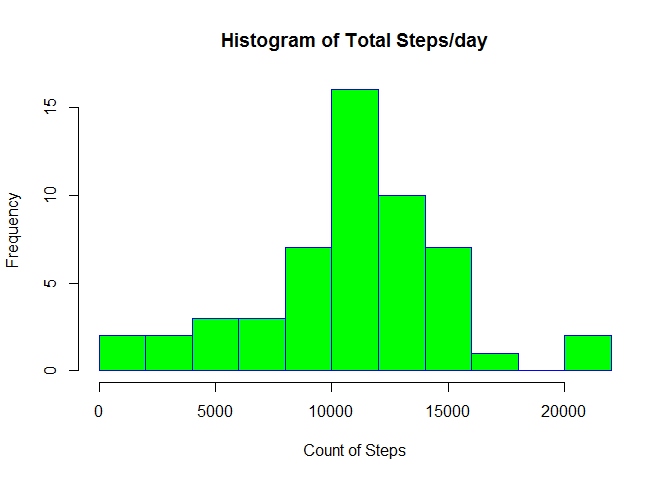
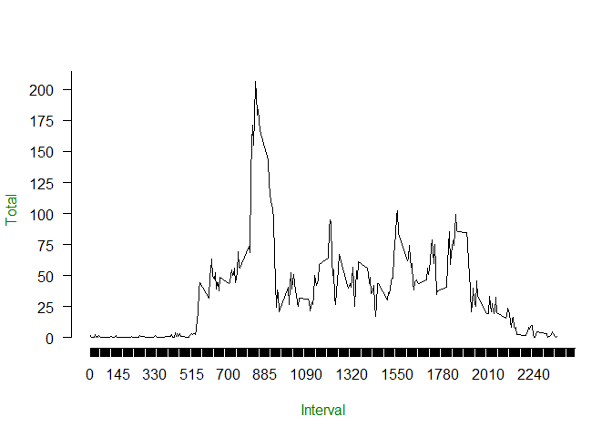
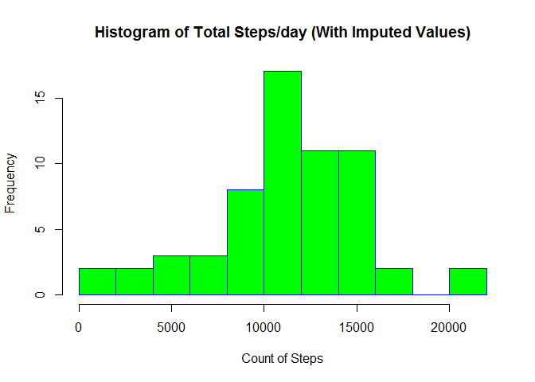
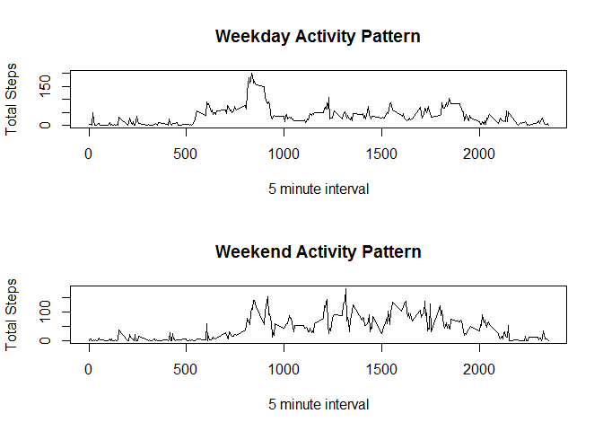

# Reproducible Research: Project 1 by Vish Yella


## Loading and preprocessing the data

Load the data using read.csv() function.  Create a new dataframe that removes the NA values.


```r
activitydata  <- read.csv("activity.csv")
activitydata2 <- na.omit(activitydata)
```


## What is mean total number of steps taken per day?

For this part of the assignment, we ignore the missing values in the dataset. Hence we use the activitydata2 dataframe.

    Calculate the total number of steps taken per day by using aggregate function:
    

```r
activitydatatotalbydate <- aggregate(activitydata2[,1], by = list(activitydata2$date), FUN = sum)

colnames(activitydatatotalbydate) <- c("Date", "TotalSteps")
```
   Make a histogram of the total number of steps taken each day
   

```r
hist(activitydatatotalbydate$TotalSteps , breaks = 10, main = "Histogram of Total Steps/day" , xlab = "Count of Steps" , border = "blue", col = "green")
```


   
   
   
   Calculate and report the mean and median of the total number of steps taken per day

```r
mean(activitydatatotalbydate$TotalSteps) 
```

```
## [1] 10766.19
```

```r
median(activitydatatotalbydate$TotalSteps)
```

```
## [1] 10765
```


## What is the average daily activity pattern?

        Calculate the total number of steps taken per interval by using aggregate function:


```r
activitydatatotalbyinterval <- aggregate(activitydata2[,1], by = list(activitydata2$interval), FUN = mean)
```

    Make a time series plot (i.e. type = "l") of the 5-minute interval (x-axis) and the average number of steps taken, averaged across all days (y-axis)
 

```r
 plot(activitydatatotalbyinterval, type = "l", axes = FALSE, ann = FALSE)
 axis(2,  las = 1, at = 25*0:max(activitydatatotalbyinterval$Group.1))
 axis(1, at = 5*0:max(activitydatatotalbyinterval$Group.1)) 
 # Label the x and y axes with dark green text
 title(xlab= "Interval", col.lab=rgb(0,0.5,0))
 title(ylab= "Total", col.lab=rgb(0,0.5,0))
```


    
    
    The above plot shows that 835 5-minute interval, on average across all the days in the dataset, contains the maximum number of steps.  It has total of just over 200.


## Imputing missing values

 
For replaceing the missing values I have used the MICE package's mice() function.  Please refer to full documentation at <https://cran.r-project.org/web/packages/mice/mice.pdf>.  Specifically I used the "pmm" method referenced in page 67.

I have used md.patter to find the total number of missing values in the dataset (i.e. the total number of rows with NAs)
    

```r
library(mice)
```

```
## Warning: package 'mice' was built under R version 3.2.3
```

```
## Loading required package: Rcpp
```

```
## mice 2.25 2015-11-09
```

```r
 md.pattern(activitydata)
```

```
##       date interval steps     
## 15264    1        1     1    0
##  2304    1        1     0    1
##          0        0  2304 2304
```
    
This tells us that 2304 values are missing values in STEPS column.  
This tells us that 1528 values do NOT have any missing values in any 3 columns.

    
    
    
    The strategy I have used to fill missing data is using "predictive mean method" (pmm) of mice package. Note that advanced variations can be used to increaes the number of iterations etc.  For the purpose of this initial assignment, I have opted to use just one iteration.  completedData contains the dataframe with missing values replaced with pmm values.
    

```r
tempdata <- mice(activitydata, m=1 , method ="pmm", maxit = 1, seed = 500 )
```

```
## 
##  iter imp variable
##   1   1  steps
```

```r
completedData <- complete(tempdata, 1)
```
    
    
    
    
    After creating the above new dataset that is equal to the original dataset but with the missing data filled in we make a histogram of the total number of steps taken each day and Calculate and report the mean and median total number of steps taken per day. 
    

```r
completedDatatotals <- aggregate(completedData[,1], by = list(completedData$date), FUN = sum)

colnames(completedDatatotals) <- c("Date", "TotalSteps")

hist(completedDatatotals$TotalSteps , breaks = 10, main = "Histogram of Total Steps/day (With Imputed Values)" , xlab = "Count of Steps" , border = "blue", col = "green")
```



```r
mean(completedDatatotals$TotalSteps)
```

```
## [1] 11164.41
```

```r
median(completedDatatotals$TotalSteps)
```

```
## [1] 11162
```
    
    
    The impact of imputing missing data on the estimates of the total daily number of steps:
    
    These new values (mean = 11164.41, median = 11162) differ from the estimates from the first part of the assignment(mean = 10766.19, median = 10765).  
    
    However, these are not significant changes given the range of data.  I also note that although mean, medians are similar, the spread of data might vary depending on the strategy opted for replacing the missing values.  If the missing values were replaced with daily average versus interval average, these will affect the mean and median values.  The MICE package has many options for replacing missing values.
    
    

## Are there differences in activity patterns between weekdays and weekends?

For this part I have used the timeDate package. I am using the completedData dataset with the filled-in missing values for this part.  I create a new column called isweekday with logical values TRUE/FALSE:


```r
install.packages("timeDate" ,repos = "http://cran.us.r-project.org")
```

```
## Installing package into 'C:/Users/IBM_ADMIN/Documents/R/win-library/3.2'
## (as 'lib' is unspecified)
```

```
## package 'timeDate' successfully unpacked and MD5 sums checked
## 
## The downloaded binary packages are in
## 	C:\Users\IBM_ADMIN\AppData\Local\Temp\RtmpuUUYWK\downloaded_packages
```

```r
library(dplyr)
```

```
## 
## Attaching package: 'dplyr'
```

```
## The following objects are masked from 'package:stats':
## 
##     filter, lag
```

```
## The following objects are masked from 'package:base':
## 
##     intersect, setdiff, setequal, union
```

```r
library(timeDate)
```

```
## Warning: package 'timeDate' was built under R version 3.2.3
```

```r
adwday <- mutate(completedData, isweekday= isWeekday(completedData$date, wday=1:5))
weekdaydata <-adwday[adwday$isweekday == TRUE , 1:3 ]
weekenddata <-adwday[adwday$isweekday == FALSE , 1:3 ]
weekdaydatabyinterval <- aggregate( weekdaydata[,1] , by = list(weekdaydata$interval), FUN = mean) 
weekenddatabyinterval <- aggregate( weekenddata[,1] , by = list(weekenddata$interval), FUN = mean) 
```

 
    We now make a panel plot containing a time series plot (i.e. type = "l") of the 5-minute interval (x-axis) and the average number of steps taken, averaged across all weekday days or weekend days (y-axis).  


```r
par(mfrow=c(2,1))
plot(weekdaydatabyinterval, type="l" , main = "Weekday Activity Pattern" , xlab = "5 minute interval" , ylab = "Total Steps")
plot(weekenddatabyinterval, type="l" , main = "Weekend Activity Pattern"  , xlab = "5 minute interval" , ylab = "Total Steps")
```



    This plot shows that on weekends there is more activity from afternoon through late evening.  
